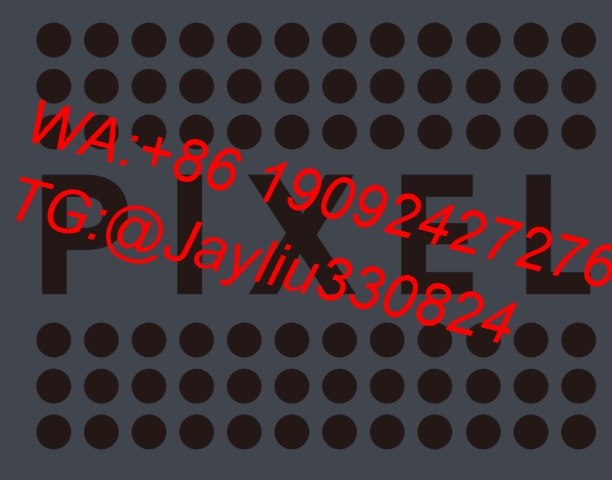

# Facebook广告全渠道运营优化方案

---

## 层级化账户管理模型
### 1.1 账户架构标准
**测试培育组**
- 时段配置：本地黄金时段±2小时
- 素材组合：每日6套创意组合(图片/视频/轮播)
- 晋级机制：CTR连续三天超2.5%提升层级

**核心运营集群**
| 账户类型       | 核心策略                | 预算分配  |
|----------------|-----------------------|----------|
| 基础转化组     | 种子用户深度运营        | 45%      |
| 增量运营库     | 动态兴趣词挖掘         | 25%      |
| 休眠唤醒池     | 跨平台行为重定向        | 15%      |
| 弹性储备金     | 突发流量承接能力        | 15%      |

---

## 创意资产生命管理
### 2.1 素材生产流程
```step
需求分析 → 素材元素解构 → 创意组合生成 → 全渠道压力测试 → 数据智能归档
```

### 2.2 黄金创意公式
```
爆款产出系数 = (冲突指数 × 0.5) + (情绪唤醒 × 0.3) + (实证支撑 × 0.2)
创作核心要素：
[产品核心痛点] → [解决方案演示] → [权威数据背书] → [立即行动激励]
```

---

## 动态调控机制
### 3.1 智能出价体系
```sql
竞价决策 = 
CASE 
  WHEN 时段流量质量 ≥8 THEN 基准价×1.3
  WHEN 竞争强度 >60 THEN 基准价×0.8
  ELSE 动态平衡模型
END
```

### 3.2 预算风险防控
| 风险等级 | 处置方案               | 执行时效 | 
|----------|-----------------------|---------|
| 橙色预警 | 广告组暂停+素材轮换    | ≤15分钟 |
| 红色警报 | 账户熔断+启动备用体系  | ≤5分钟  |
| 黑色警报 | 全渠道断流+人工介入    | 即时生效|

---

## 精准定向策略
### 4.1 用户价值矩阵
| 价值等级 | 运营侧重               | 内容策略             |
|----------|-----------------------|---------------------|
| 高阶用户 | 会员体系渗透           | 专属权益优先展示     |
| 潜力用户 | 决策场景再造           | KOC口碑内容培育     |
| 流失用户 | 价值重建策略           | 痛点直击型素材       |

### 4.2 兴趣词应用模型
```process
基础词库构建 → 语义扩展模型 → 竞争热度筛查 → 投放矩阵组合 → 效果动态复盘
```

---

## 数据化运营体系
### 5.1 核心监测指标
| 维度         | 预警线         | 优化方案                     |
|--------------|---------------|----------------------------|
| 素材同质化率 | >30%持续3天   | 创意元素结构化重构           |
| 用户获取成本 | 超均值25%      | 定向策略精准微调             |
| 复购衰减指数 | 周降幅>15%    | 会员激励体系升级             |

### 5.2 应急恢复方案
- **数据保全**：每日05:00全量快照
- **资源接管**：
  1. 新版位自动接管(Feed→Stories)
  2. 高转化素材池同步启用
  3. 支付链路智能切换
  4. 已验证受众即时迁移

> **运营备忘录**：每季度进行全账户策略沙盘推演，重大营销节点提前21天制定专项预案，素材库保持15%冗余空间应对突发事件。
> [教学视频](https://youtube.com/shorts/WFddDF8fgbQ?feature=share)
```
